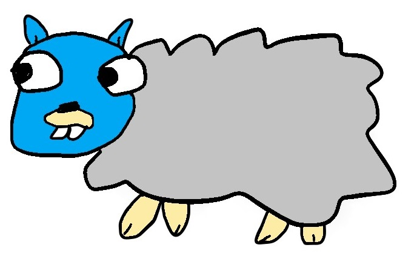

# lamb-code



微服務風格的簡易 Online Judge，目前只支援 Golang 1.20。  

服務拆分成：  

- problem (題庫與測資)
- judge (批改提交答案)
- playground (虛擬執行環境集群)

服務流程：  

1. 使用者向 judge 提交答案
2. judge 向 problem 提取測資，將答案與測資交給 playground 運行  
3. 比對輸出是否預期，回傳評測結果  

## 系統需求

- MySQL
- RabbitMQ
- Golang
- Docker (可選)

## 使用方式

網頁入口：  
<http://localhost:19811/index>

### Docker 部署

首先建構 docker image，名稱為 lamb-code。  

```console
docker build -t lamb-code .
```

使用 docker compose 啟動系統依賴。  
包含 RabbitMQ, MySQL。  

```console
docker compose -f .\docker-compose-dependency.yaml up -d
```

確認系統依賴啟動完成，再啟動 lamb-code 即可。  

```console
docker compose up -d
```

### 手動部署

#### 自訂系統依賴

也可以使用自訂的 MySQL, RabbitMQ。  
修改 config/config.ini 中各服務設定。  
記得建立 database problem，並匯入 SQL。  

```console
[db]
host=localhost
..

[mq]
host=localhost
..
```

#### 啟動 lamb-code

同樣修改 host。  

```console
[service.problem]
host=localhost
..

[service.judge]
host=localhost
..
```

執行 server.bat。  
